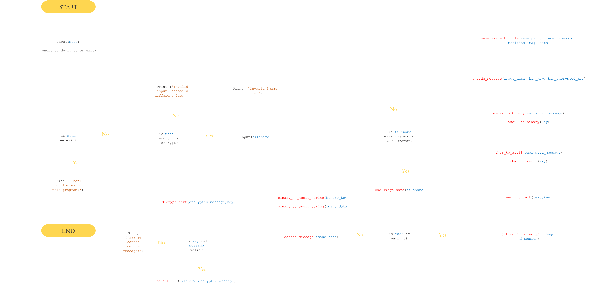

# Super Secure Steganography using Python

---

## 📝 Code Flowchart

  

## ❓ What the software does?

- 1. Selects a Program Mode, can either be encrypt or decrypt.
- 2. Loading and Saving Image Data - gets the image's rgb data in per pixel that will either be encrypted or decrypted based on the program mode.

In encrypt mode:  

- 3. Encrypting the Message using a given Key.
- 4. Translate Key and Message from String to Binary.
- 5. Adding the Key and Message Binary to the Image.

In decrypt mode:  

- 3. Extract Key and Message Binary from Image Data.
- 4. Translate Key and Message from Binary to String.
- 5. Decrypt the Message using a Given Key.
- 6. Save Decrypted Message to Text File

See a more detailed demonstration in the flowchart below.

  

## 📝 Description

“Steganography includes the concealment of information within computer files. In digital steganography, electronic
communications may include steganographic coding inside of a transport layer, such as a document file, image file,
program, or protocol. Media files are ideal for steganographic transmission because of their large size.”

- <a href="https://en.wikipedia.org/wiki/Steganography">Wikipedia on Steganography</a>

  

## 🗓️ Date Finished

February, 2022

  

## ⌛ Time Spent

1 month

  

## ⚙️ Tools and Languages

- Python
- Pillow Library
